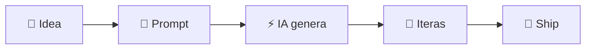
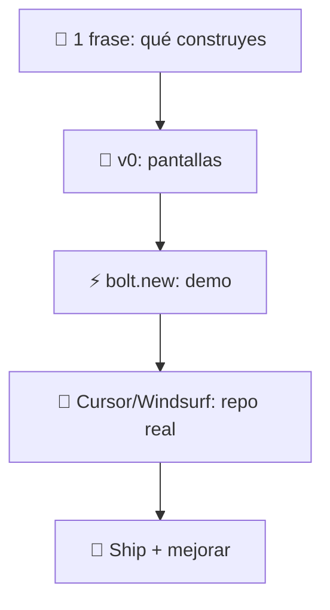

# Vibe_Coding — Vibe Coding (IA)

  
  
  

  <b>Idea → UI → Prototipo → Código → Ship</b>

---

## ¿Qué es?

---

## Toolbox (modo presentación)

<table>
  <tr>
    <td align="center" width="25%">
      
       <b>Cursor</b>
       Editor + IA en el repo
       ✍️ Code • 🔧 Refactor
    </td>
    <td align="center" width="25%">
      
       <b>bolt.new</b>
       Prototipos en navegador
       ⚡ MVP • 🌍 Share link
    </td>
    <td align="center" width="25%">
      
       <b>Windsurf</b>
       Flow + agentes
       🤖 Multi-file • 🧭 Navega
    </td>
    <td align="center" width="25%">
      
       <b>v0</b>
       UI desde prompt
       🎨 Screens • 🧱 Components
    </td>
  </tr>
</table>

---

## Workflow express (30s)

---

## Prompt pack (rápido)

- “Hazlo funcionar” ✅
- “Ahora hazlo limpio” 🧼
- “Agrega tests y docs” 🧪📚
- “Optimiza sin cambiar comportamiento” ⚙️

---

## Tabla comparativa (rápida)

| Herramienta | Mejor para | Output típico | Punto fuerte | Ideal si tú quieres… |
|---|---|---|---|---|
| **Cursor** | Construir y mantener el repo | Código + refactors + fixes | Contexto del proyecto (multi-archivo) | “Trabajar serio en el código del repo con IA” |
| **Windsurf** | Flow + cambios grandes | Cambios multi-archivo | Agentes / navegación / autocomplete | “Iterar rápido en proyectos medianos-grandes” |
| **bolt.new** | Prototipo en 1 click | App demo compartible | Cero setup + link listo | “Validar una idea hoy en minutos” |
| **v0** | UI/Frontend desde prompt | Pantallas + componentes | Diseño veloz (UI) | “Sacar pantallas lindas rápido” |

---

## Recursos / links (docs oficiales)

- **Cursor**  
  - Sitio: https://cursor.com  
  - Docs: https://docs.cursor.com

- **Windsurf (Codeium)**  
  - Sitio: https://windsurf.ai  
  - Docs: https://codeium.com/windsurf

- **bolt.new (StackBlitz)**  
  - Sitio: https://bolt.new  
  - StackBlitz: https://stackblitz.com

- **v0 (Vercel)**  
  - Sitio: https://v0.dev  
  - Vercel: https://vercel.com

---
