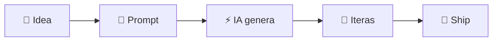

  <h1>
     Vibe Coding (IA)
  </h1>

  
  
  

  <b>Idea → UI → Prototipo → Código → Ship</b>

#

## ¿Qué es?

#

## Toolbox (modo presentación)

<table>
  <tr>
    <td align="center" width="25%">
      
       <b>Cursor</b>
       Editor + IA en el repo
       ✍️ Code • 🔧 Refactor
    </td>
    <td align="center" width="25%">
      
       <b>bolt.new</b>
       Prototipos en navegador
       ⚡ MVP • 🌍 Share link
    </td>
    <td align="center" width="25%">
      
       <b>Windsurf</b>
       Flow + agentes
       🤖 Multi-file • 🧭 Navega
    </td>
    <td align="center" width="25%">
      
       <b>v0</b>
       UI desde prompt
       🎨 Screens • 🧱 Components
    </td>
  </tr>
</table>

#

  

#

<table>
  <tr>
    <td align="center" width="720" valign="top">
      
       
      <b>Cursor</b>
        
      <a href="https://docs.cursor.com">📘 Docs</a> &nbsp;•&nbsp;
      <a href="https://cursor.com">🌐 Site</a>
    </td>
  </tr>

  <tr>
    <td align="center" width="720" valign="top">
      
       
      <b>Windsurf</b>
        
      <a href="https://codeium.com/windsurf">📘 Docs</a> &nbsp;•&nbsp;
      <a href="https://windsurf.ai">🌐 Site</a>
    </td>
  </tr>

  <tr>
    <td align="center" width="720" valign="top">
      
       
      <b>bolt.new</b>
        
      <a href="https://bolt.new">🌐 Site</a> &nbsp;•&nbsp;
      <a href="https://stackblitz.com">⚡ StackBlitz</a>
    </td>
  </tr>

  <tr>
    <td align="center" width="720" valign="top">
      
       
      <b>v0</b>
        
      <a href="https://v0.dev">🌐 Site</a> &nbsp;•&nbsp;
      <a href="https://vercel.com">▲ Vercel</a>
    </td>
  </tr>
</table>

#
