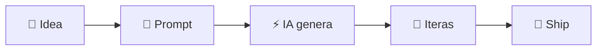
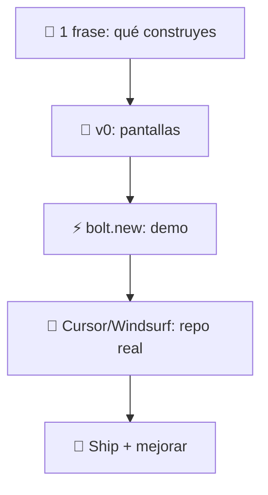

# Vibe_Coding — Vibe Coding (IA)

  
  
  

  <b>Idea → UI → Prototipo → Código → Ship</b>

---

## ¿Qué es?

---

## Toolbox (modo presentación)

<table>
  <tr>
    <td align="center" width="25%">
      
       <b>Cursor</b>
       Editor + IA en el repo
       ✍️ Code • 🔧 Refactor
    </td>
    <td align="center" width="25%">
      
       <b>bolt.new</b>
       Prototipos en navegador
       ⚡ MVP • 🌍 Share link
    </td>
    <td align="center" width="25%">
      
       <b>Windsurf</b>
       Flow + agentes
       🤖 Multi-file • 🧭 Navega
    </td>
    <td align="center" width="25%">
      
       <b>v0</b>
       UI desde prompt
       🎨 Screens • 🧱 Components
    </td>
  </tr>
</table>

---

## Workflow express (30s)

---

## Prompt pack (rápido)

- “Hazlo funcionar” ✅
- “Ahora hazlo limpio” 🧼
- “Agrega tests y docs” 🧪📚
- “Optimiza sin cambiar comportamiento” ⚙️

---

---

## ⚔️ Comparativa (pro)

<table>
  <tr>
    <th align="left">Tool</th>
    <th align="left">Best for</th>
    <th align="left">Output</th>
    <th align="left">Strength</th>
    <th align="left">Choose it if…</th>
  </tr>

  <tr>
    <td>
      
      <b> Cursor</b>
    </td>
    <td>Repo real + dev diario</td>
    <td>✍️ code • 🔧 refactor • 🧪 tests</td>
    <td>Contexto del proyecto (multi-file)</td>
    <td>Quieres <b>construir</b> y <b>mantener</b> el código en tu repo</td>
  </tr>

  <tr>
    <td>
      
      <b> Windsurf</b>
    </td>
    <td>Flow + cambios grandes</td>
    <td>🤖 agent • 🧭 navegación • 🧩 consistencia</td>
    <td>Agentes y edición a escala</td>
    <td>Quieres iterar rápido con cambios multi-archivo</td>
  </tr>

  <tr>
    <td>
      
      <b> bolt.new</b>
    </td>
    <td>Prototipo instantáneo</td>
    <td>⚡ MVP • 🌍 link demo</td>
    <td>Cero setup (browser)</td>
    <td>Quieres validar la idea <b>hoy</b> en minutos</td>
  </tr>

  <tr>
    <td>
      
      <b> v0</b>
    </td>
    <td>UI desde prompt</td>
    <td>🎨 screens • 🧱 components</td>
    <td>Diseño rápido (frontend)</td>
    <td>Quieres pantallas bonitas rápido y luego integrar</td>
  </tr>
</table>

---

## 🔗 Recursos oficiales (con iconos)

<table>
  <tr>
    <td width="50%">
      
      <b> Cursor</b> 
      
        • Site: https://cursor.com 
        • Docs: https://docs.cursor.com
      
    </td>
    <td width="50%">
      
      <b> Windsurf</b> 
      
        • Site: https://windsurf.ai 
        • Docs: https://codeium.com/windsurf
      
    </td>
  </tr>

  <tr>
    <td width="50%">
      
      <b> bolt.new</b> 
      
        • Site: https://bolt.new 
        • StackBlitz: https://stackblitz.com
      
    </td>
    <td width="50%">
      
      <b> v0</b> 
      
        • Site: https://v0.dev 
        • Vercel: https://vercel.com
      
    </td>
  </tr>
</table>

---
